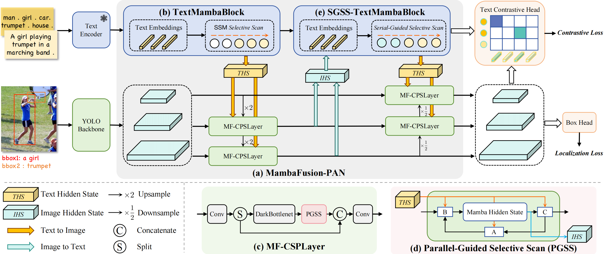
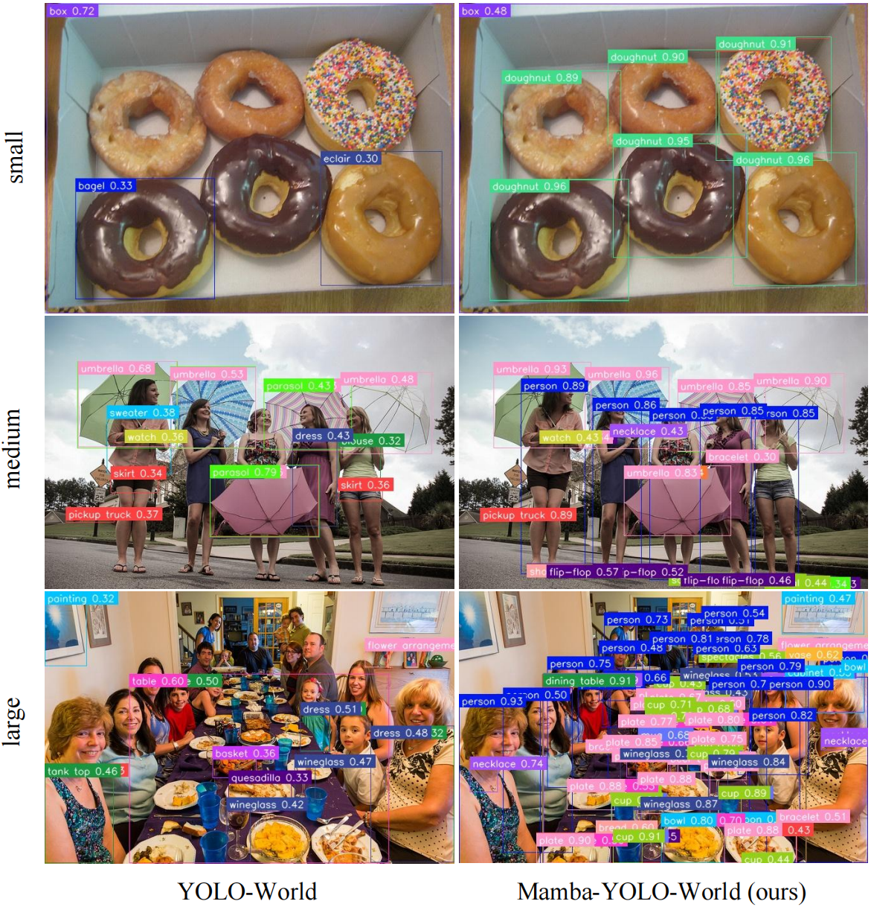

# Mamba-YOLO-World
Open-vocabulary detection (OVD) aims to detect objects beyond a predefined set of categories.
As a pioneering model incorporating the YOLO series into OVD, YOLO-World is well-suited for scenarios prioritizing speed and efficiency.
However, its performance is hindered by its neck feature fusion mechanism, which causes the quadratic complexity and the limited guided receptive fields. 
To address these limitations, we present Mamba-YOLO-World, a novel YOLO-based OVD model employing the proposed MambaFusion Path Aggregation Network (MambaFusion-PAN) as its neck architecture.
Specifically, we introduce an innovative State Space Model-based feature fusion mechanism consisting of a Parallel-Guided Selective Scan algorithm and a Serial-Guided Selective Scan algorithm with linear complexity and globally guided receptive fields.
It leverages multi-modal input sequences and mamba hidden states to guide the selective scanning process.
Experiments demonstrate that our model outperforms the original YOLO-World on the COCO and LVIS benchmarks in both zero-shot and fine-tuning settings while maintaining comparable parameters and FLOPs. 
Additionally, it surpasses existing state-of-the-art OVD methods with fewer parameters and FLOPs.

## News
We provide the Visualization Results of ZERO-SHOT Inference on Lvis generated by Mamba-YOLO-World and YOLO-World for comparison. <br>
**Code and model weights are coming soon.**

## Introduction
This repo contains the PyTorch implementation, pre-trained weights, and pre-training/fine-tuning code for Mamba-YOLO-World.

* We present Mamba-YOLO-World, a novel YOLO-based OVD model employing the proposed MambaFusion-PAN as its neck architecture.

* We introduce a State Space Model-based feature fusion mechanism consisting of a Parallel-Guided Selective Scan algorithm and a Serial-Guided Selective Scan algorithm, with O(N+1) complexity and globally guided receptive fields.

* Experiments demonstrate that our model outperforms the original YOLO-World while maintaining comparable parameters and FLOPs. Additionally, it surpasses existing state-of-the-art OVD methods with fewer parameters and FLOPs.

<div align="center">

</div>

## Model Zoo

### Zero-shot Evaluation on LVIS-minival dataset

<div><font size=2>

| model                                                             | Pre-train Data       | AP<sup>mini</su> | AP<sub>r</sub> | AP<sub>c</sub> | AP<sub>f</sub> | weights |
|:------------------------------------------------------------------| :------------------- |:----------------:|:--------------:|:--------------:|:--------------:|:-------:|
| [Mamba-YOLO-World-S](configs/mamba2_yolo_world_v2_s.py)           | O365+GoldG |       27.7       |      19.5      |      27.0      |      29.9      |         |
| [Mamba-YOLO-World-M](configs/mamba2_yolo_world_v2_m.py)           | O365+GoldG |       32.8       |      27.0      |      31.9      |      34.8      |         | 
| [Mamba-YOLO-World-L](configs/mamba2_yolo_world_v2_l.py)           | O365+GoldG |       35.0       |      29.3      |      34.2      |      36.8      |         | 

</font>
</div>

### Zero-shot Evaluation on COCO dataset

<div><font size=2>

| model                                                             | Pre-train Data       |  AP  | AP<sub>50</sub> | AP<sub>75</sub> | weights |
|:------------------------------------------------------------------| :------------------- |:----:|:---------------:|:---------------:|:-------:|
| [Mamba-YOLO-World-S](configs/mamba2_yolo_world_v2_s.py)           | O365+GoldG | 38.0 |      52.9       |      41.0       |         |
| [Mamba-YOLO-World-M](configs/mamba2_yolo_world_v2_m.py)           | O365+GoldG | 43.2 |      58.8       |      46.6       |         | 
| [Mamba-YOLO-World-L](configs/mamba2_yolo_world_v2_l.py)           | O365+GoldG | 45.4 |      61.3       |      49.4       |         | 

</font>
</div>

### Fine-tuning Evaluation on COCO dataset

<div><font size=2>

| model                                                             | Pre-train Data       |  AP  | AP<sub>50</sub> | AP<sub>75</sub> | weights |
|:------------------------------------------------------------------| :------------------- |:----:|:---------------:|:---------------:|:-------:|
| [Mamba-YOLO-World-S](configs/mamba2_yolo_world_v2_s.py)           | O365+GoldG | 46.4 |      62.5       |      50.5       |         |
| [Mamba-YOLO-World-M](configs/mamba2_yolo_world_v2_m.py)           | O365+GoldG | 51.4 |      68.2       |      56.1       |         | 
| [Mamba-YOLO-World-L](configs/mamba2_yolo_world_v2_l.py)           | O365+GoldG | 54.1 |      71.1       |      59.0       |         | 

</font>
</div>

## Getting started

### 1. Installation

Mamba-YOLO-World is developed based on `torch==2.0.0`,`mamba-ssm==2.1.0`, `mmyolo==0.6.0`,`mmcv==2.0.1`, `mmyolo==0.6.0` and `mmdetection==3.3.0`. 

### 2. Preparing Data

We provide the details about the pre-training data in [docs/data](./docs/data.md).

##  Evaluation
```bash
./tools/dist_test.sh configs/mamba2_yolo_world_v2_s.py  CHECKPOINT_FILEPATH  num_gpus_per_node
./tools/dist_test.sh configs/mamba2_yolo_world_v2_m.py  CHECKPOINT_FILEPATH  num_gpus_per_node
./tools/dist_test.sh configs/mamba2_yolo_world_v2_l.py  CHECKPOINT_FILEPATH  num_gpus_per_node
```

## Pre-training
```bash
./tools/dist_train.sh configs/mamba2_yolo_world_v2_s.py  num_gpus_per_node  --amp
./tools/dist_train.sh configs/mamba2_yolo_world_v2_m.py  num_gpus_per_node  --amp
./tools/dist_train.sh configs/mamba2_yolo_world_v2_l.py  num_gpus_per_node  --amp
```


## Fine-tuning
```bash
./tools/dist_train.sh configs/mamba2_yolo_world_v2_s_mask-refine_finetune_coco.py  num_gpus_per_node --amp 
./tools/dist_train.sh configs/mamba2_yolo_world_v2_m_mask-refine_finetune_coco.py  num_gpus_per_node --amp 
./tools/dist_train.sh configs/mamba2_yolo_world_v2_l_mask-refine_finetune_coco.py  num_gpus_per_node --amp 
```

## Demo


- `image_demo.py`: inference with images or a directory of images
<div align="center">

</div>

## Acknowledgement

We sincerely thank [mmyolo](https://github.com/open-mmlab/mmyolo), [mmdetection](https://github.com/open-mmlab/mmdetection), [YOLO-World](https://github.com/AILAB-CVC/YOLO-World), [Mamba](https://github.com/state-spaces/mamba) and [VMamba](https://github.com/MzeroMiko/VMamba) for providing their wonderful code to the community!

